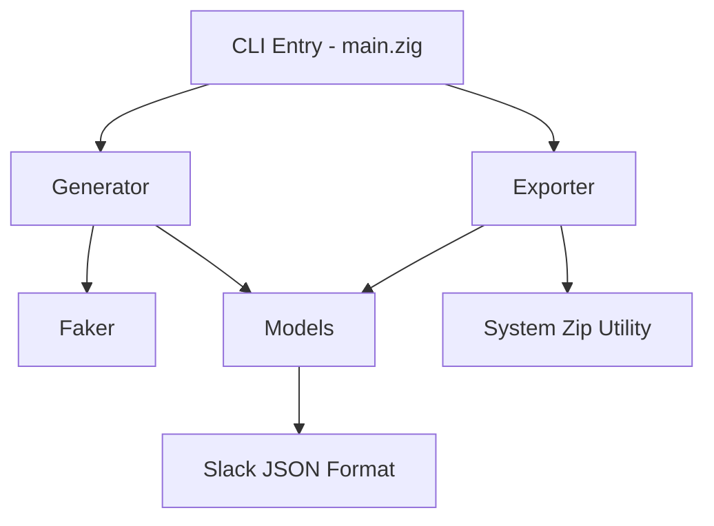
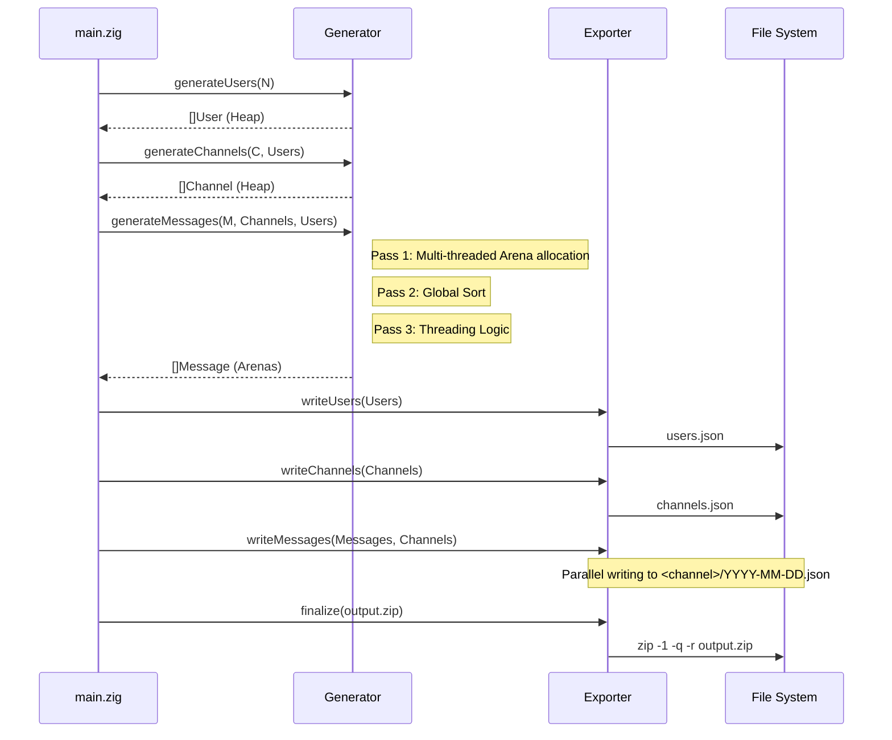

# Architecture: syngen-zig

`syngen-zig` is designed for massive-scale synthetic data generation with a focus on realism, performance, and memory safety.

## System Overview

The application follows a modular architecture where data generation is decoupled from the final export format.

## Core Components

### 1. Faker (`src/faker.zig`)
Responsible for generating individual data points using fixed datasets:
- **Names**: ~1000 first and last names.
- **Text**: Lorem Ipsum sentence and paragraph generation.
- **IDs**: Slack-compliant ID formats (`U...`, `C...`, `T...`).
- **Hashes**: 32-char hex strings for avatars.

### 2. Generator (`src/generator.zig`)
The orchestration layer for data creation. It uses a **Three-Pass Algorithm**:

| Pass | Type | Description |
| :--- | :--- | :--- |
| **Pass 1** | Parallel | **Data Creation**: Divide total messages into chunks. Each CPU core generates text, timestamps, and user/channel assignments using thread-local `ArenaAllocators` and PRNGs. |
| **Pass 2** | Sequential | **Sorting**: Sort the combined message array by timestamp to establish a chronological baseline. |
| **Pass 3** | Sequential | **Threading**: Assign `thread_ts` and `replies` based on probability and a 3-day conversational window. |

### 3. Exporter (`src/exporter.zig`)
Handles the transformation of internal models into the physical Slack export directory structure:
- **Parallel Writing**: Distributes the writing of thousands of JSON files across threads by grouping messages per channel.
- **Streaming Serialization**: Uses a fixed 64KB buffer to stream JSON directly to disk, avoiding massive heap allocations for 2M+ messages.
- **Archive Finalization**: Truncates existing archives and uses the system `zip` with level `-1` (fastest) for maximum throughput.

## Data Flow

## Memory Management Strategy

`syngen-zig` uses a hybrid memory model to achieve high performance:
- **GPA (General Purpose Allocator)**: Used for long-lived objects like the `Users` and `Channels` arrays.
- **Arena Pool**: Each thread owns an `ArenaAllocator` during the message generation phase. All strings (text, IDs, timestamps) for 2M+ messages are allocated here.
- **Zero-Deinit during Generation**: Individual `deinit` calls are skipped for messages; instead, the entire arena is cleared at the end of the program, providing O(1) cleanup.

## Logging System

All internal state transitions are logged to `syngen_log.log` using a thread-safe scoped logger.
- **Format**: `UNIX_TIMESTAMP [LEVEL] (SCOPE): MESSAGE`
- **Scopes**: `.syngen` (Main), `.syngen_gen` (Generator), `.syngen_exp` (Exporter).
